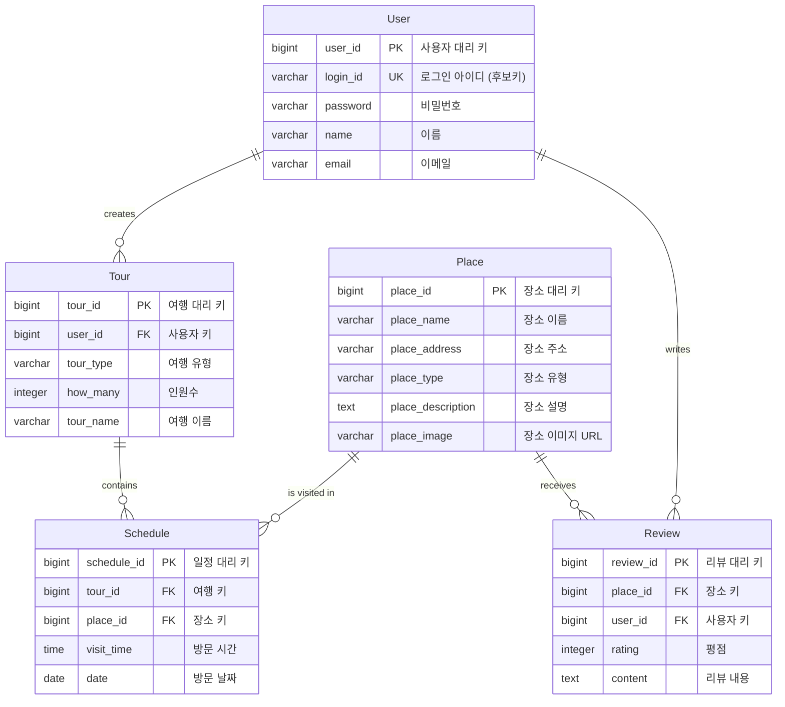

```mermaid
erDiagram
    User ||--o{ Tour : "creates"
    User ||--o{ Review : "writes"
    Tour ||--o{ Schedule : "contains"
    Place ||--o{ Schedule : "is visited in"
    Place ||--o{ Review : "receives"

    User {
        bigint user_id PK "사용자 대리 키"
        varchar login_id UK "로그인 아이디 (후보키)"
        varchar password "비밀번호"
        varchar name "이름"
        varchar email "이메일"
    }

    Tour {
        bigint tour_id PK "여행 대리 키"
        bigint user_id FK "사용자 키"
        varchar tour_type "여행 유형"
        integer how_many "인원수"
        varchar tour_name "여행 이름"
    }

    Place {
        bigint place_id PK "장소 대리 키"
        varchar place_name "장소 이름"
        varchar place_address "장소 주소"
        varchar place_type "장소 유형"
        text place_description "장소 설명"
        varchar place_image "장소 이미지 URL"
    }

    Schedule {
        bigint schedule_id PK "일정 대리 키"
        bigint tour_id FK "여행 키"
        bigint place_id FK "장소 키"
        time visit_time "방문 시간"
        date date "방문 날짜"
    }

    Review {
        bigint review_id PK "리뷰 대리 키"
        bigint place_id FK "장소 키"
        bigint user_id FK "사용자 키"
        integer rating "평점"
        text content "리뷰 내용"
    }
```